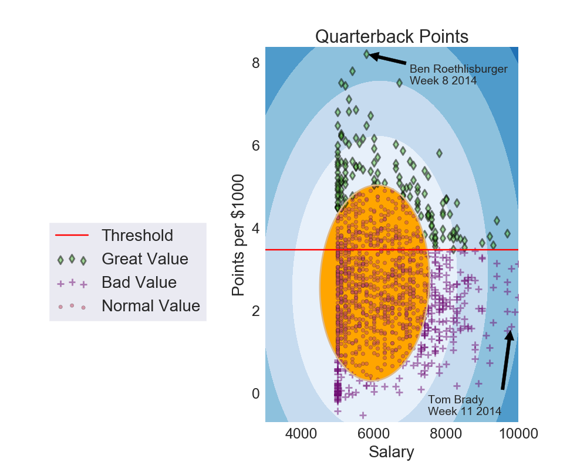

# Motivation

The purpose of this project is to formalize a regimen for selecting players for a Daily Fantasy Football team. This repo is aimed at the understanding of football data and how data science can be used to intelligently draft solid Daily Fantasy Football lineups

Players earn points for their performance in each game. Here is a link to the scoring rules for Draft Kings fantasy football:

https://www.draftkings.com/help/nfl

# The Problem

Daily Fantasy Football is huge. So huge that talking about every strategy, platform, analysis topics, and business strategies would be way outside the scope of this project. For now, I will focus only on tournament play.

Tournament play is a different monster than the other game styles. It is very easy for a lineup that looks solid at first glance and performs well to be lost in the crowd of other similar lineups. They key here is finding those outliers, those players who nobody -- or very few --  will own. A lot of the time, these low-owned players will also have a high point-per-dollar metric.

The goal is to find the best point-per-dollar players and build your lineups around them.

# Tools

-   PostgreSQL
-   SQLAlchemy
-   Pandas
-   Numpy
-   Matplotlib
-   Sci-kit Learn

# How to

This repo requires the use of nfldb, which can be found here: https://github.com/BurntSushi/nfldb
Included in my code are SQL queries from this database which are read to .csv files using pandas and SQLAlchemy.

I have scraped the web for Draft Kings salary data and saved these as .csv. The use of .csv files is for ease of load in to the data analysis tools chosen by the user.

# Draft Kings

Because of the limited time period of this project, I have decided to focus on Draft Kings salary and contests. Inside the Draft Kings/Data folder is various scraped data. The folder with Draft Kings contest data is from a Primetime slate contest that I enter every week. There is also a folder containing all historical salary data for all NFL players. Draft Kings is relatively new, and as such only has salary data since 2014.

# Data Scripts

This folder contains all my code for querying the nfldb, saving it to .csv, loading into a pandas data frame, and doing necessary cleaning and feature engineering.

points category is 1 if point production

# EDA

Points-category

In an effort to explore the feature space and discover which features were the most beneficial to which metrics, I used Recursive Feature Extraction to determine which features were best for each position.

# Models
The clustering models were implemented for an effort to classify players who might be outliers. The elliptic envelope is just one outlier detection algorithm I have used so far. Final_DF is a class to make it easy to create the dataframes you need. GBoost provides a way for classifying a player's points per $1000, with threshold at 3.75. At the same time, I am using a regressor to predict the exact value of points per $1000.

# Graphs

